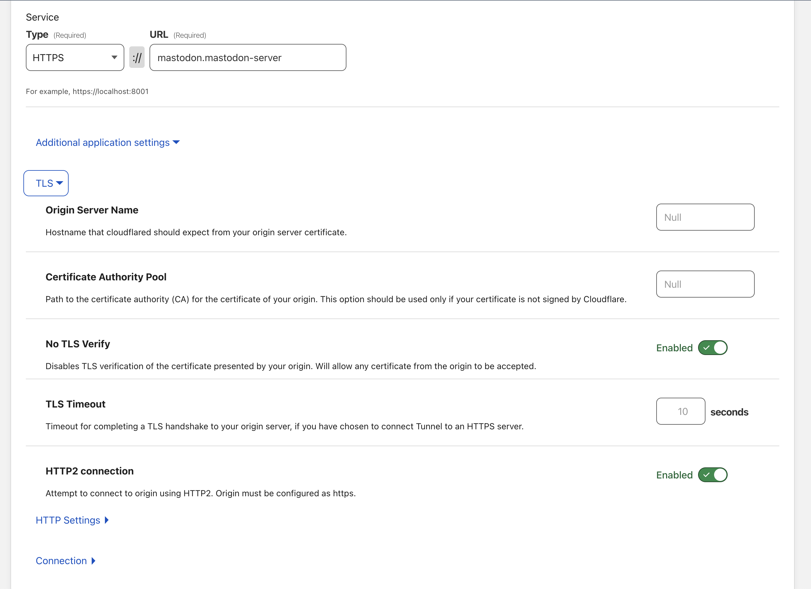

# Mastodon

A few things to note:

1. I don't have any storage for this one, as I am still trying to figure out how to work with longhorn.
2. you will need to configure your cloudflare tunnel to not validate the SSL, as linuxserver image will generate a self signed SSL certificate which will cause the app to stop working.
3. you need to create the tunnel to be like the following image

4. Feel free to update the replicas to match your needs, I found out that mastodon is a beast and needs a huge memory/processing .. etc, thats why in my own cluster I am running a 3 instances spread equaly, one in each PI.

## Longhorn requirement

You need to do the following if you are planning to use longhorn:
1. Install `open-iscii` on all nodes
2. Check the `Setting Up Longhorn` section at [K3s.io](https://docs.k3s.io/storage#setting-up-longhorn) site